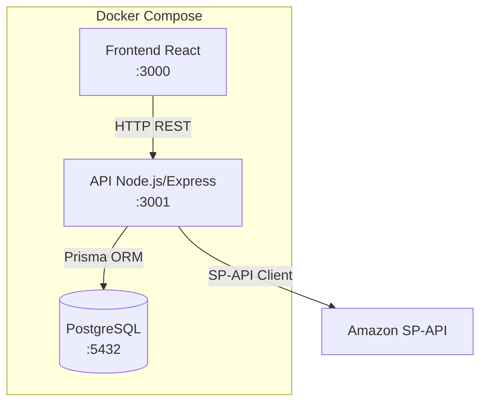
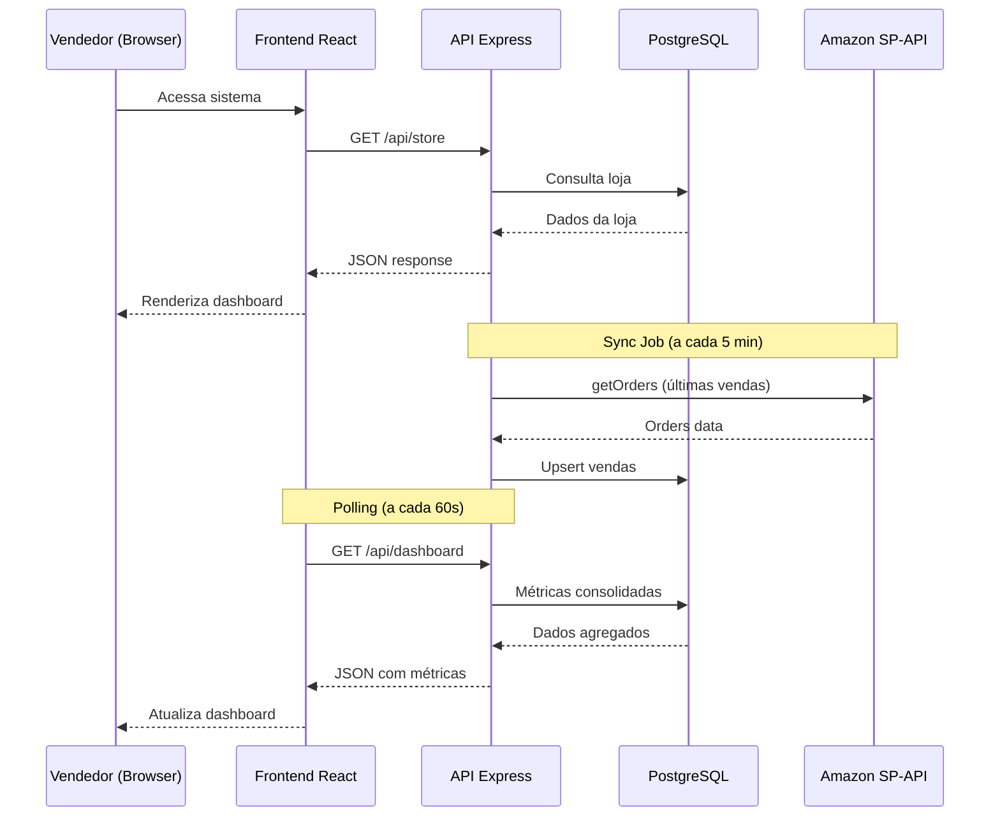
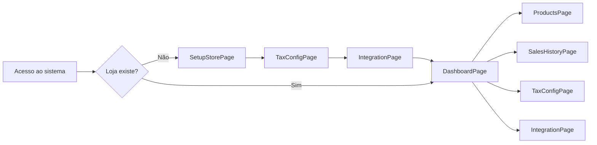
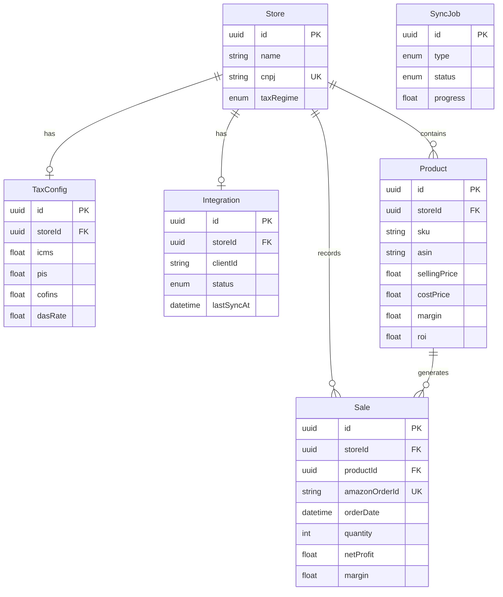
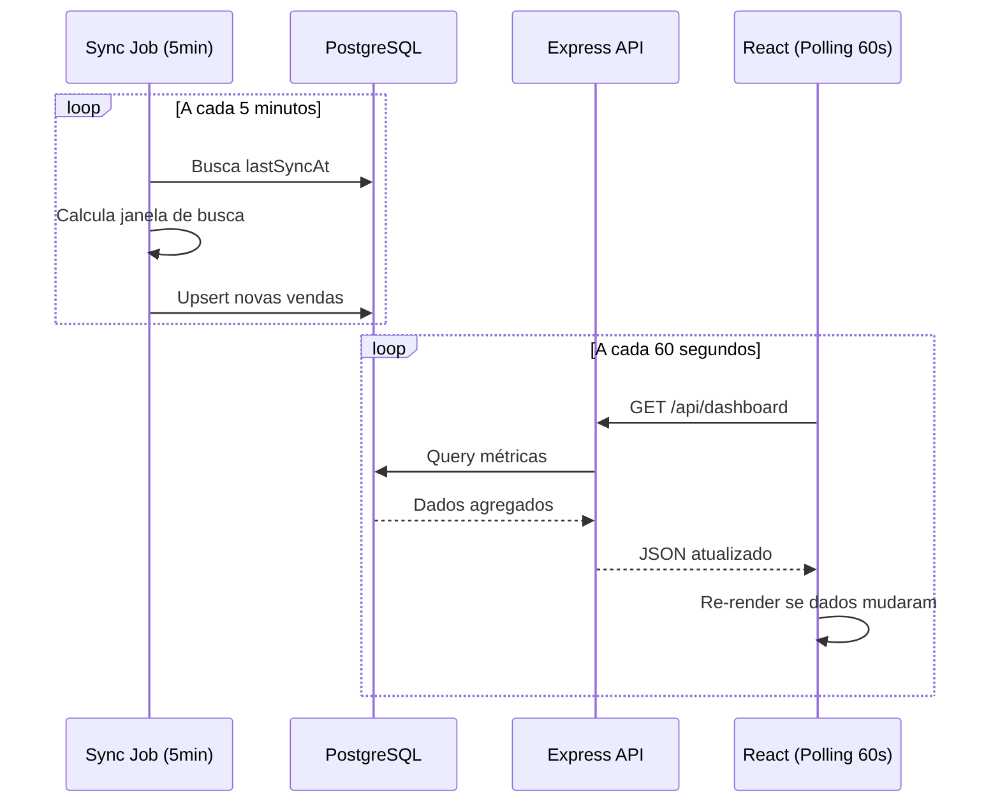

# Documento de Design

## Visão Geral

O Amazon Sales Manager é uma aplicação web local (self-hosted) para vendedores da Amazon Brasil gerenciarem suas vendas, margens de lucro e ROI. O sistema opera sem autenticação — ao iniciar, o vendedor acessa diretamente a tela principal.

A arquitetura segue o padrão de aplicação full-stack containerizada com Docker Compose, composta por três serviços principais: frontend React (porta 3000), API Node.js/Express (porta 3001) e banco de dados PostgreSQL (porta 5432). A integração com a Amazon é feita via SP-API usando o pacote `amazon-sp-api` para Node.js.

### Decisões de Design

- **Sem autenticação**: O sistema é single-user, executado localmente. Não há login, sessões ou controle de acesso.
- **Polling para atualizações**: Ao invés de WebSockets, o frontend usa polling a cada 60 segundos para atualizar o dashboard. Isso simplifica a arquitetura e é suficiente dado o requisito de "até 5 minutos".
- **Sincronização via cron job**: Um job interno na API sincroniza vendas da Amazon a cada 5 minutos usando a SP-API.
- **Cálculos no backend**: Margem e ROI são calculados no servidor ao salvar preço de compra e ao importar vendas, armazenados no banco para consultas rápidas.

---

## Arquitetura

### Diagrama de Serviços



### Diagrama de Fluxo de Dados



### Serviços Docker

| Serviço | Imagem | Porta | Descrição |
|---------|--------|-------|-----------|
| `frontend` | Node 20 + Vite | 3000 | Aplicação React com Vite |
| `api` | Node 20 | 3001 | API REST Express + Prisma |
| `db` | PostgreSQL 16 | 5432 | Banco de dados relacional |

---

## Componentes e Interfaces

### Backend (API)

#### Estrutura de Diretórios

```
api/
├── src/
│   ├── server.ts              # Entry point, Express setup
│   ├── routes/
│   │   ├── store.routes.ts    # Rotas de loja
│   │   ├── tax.routes.ts      # Rotas de impostos
│   │   ├── product.routes.ts  # Rotas de produtos
│   │   ├── sale.routes.ts     # Rotas de vendas
│   │   ├── dashboard.routes.ts# Rotas do dashboard
│   │   └── integration.routes.ts # Rotas de integração Amazon
│   ├── services/
│   │   ├── store.service.ts
│   │   ├── tax.service.ts
│   │   ├── product.service.ts
│   │   ├── sale.service.ts
│   │   ├── dashboard.service.ts
│   │   ├── margin.service.ts  # Cálculos de margem/ROI
│   │   └── amazon.service.ts  # Integração SP-API
│   ├── jobs/
│   │   └── sync.job.ts        # Cron job de sincronização
│   ├── utils/
│   │   ├── validators.ts      # Validações (CNPJ, alíquotas)
│   │   └── errors.ts          # Classes de erro customizadas
│   └── types/
│       └── index.ts           # Tipos TypeScript
├── prisma/
│   ├── schema.prisma
│   └── migrations/
├── package.json
├── tsconfig.json
└── Dockerfile
```

#### Endpoints da API

##### Loja

| Método | Rota | Descrição |
|--------|------|-----------|
| `GET` | `/api/store` | Retorna dados da loja (ou null se não existe) |
| `POST` | `/api/store` | Cria a loja |
| `PUT` | `/api/store` | Atualiza dados da loja |

##### Impostos

| Método | Rota | Descrição |
|--------|------|-----------|
| `GET` | `/api/store/tax` | Retorna configuração de impostos |
| `PUT` | `/api/store/tax` | Atualiza configuração de impostos |

##### Produtos

| Método | Rota | Descrição |
|--------|------|-----------|
| `GET` | `/api/products` | Lista todos os produtos |
| `GET` | `/api/products/:id` | Retorna um produto específico |
| `PUT` | `/api/products/:id/cost` | Atualiza preço de compra |

##### Vendas

| Método | Rota | Descrição |
|--------|------|-----------|
| `GET` | `/api/sales` | Lista vendas com filtros (período) |
| `GET` | `/api/sales/:id` | Retorna uma venda específica |

##### Dashboard

| Método | Rota | Descrição |
|--------|------|-----------|
| `GET` | `/api/dashboard` | Métricas consolidadas do dia |
| `GET` | `/api/dashboard?startDate=&endDate=` | Métricas por período |

##### Integração Amazon

| Método | Rota | Descrição |
|--------|------|-----------|
| `POST` | `/api/integration/connect` | Salva credenciais e testa conexão |
| `GET` | `/api/integration/status` | Status da integração |
| `POST` | `/api/integration/sync/products` | Dispara importação de produtos |
| `POST` | `/api/integration/sync/sales` | Dispara importação de vendas históricas |
| `GET` | `/api/integration/sync/progress` | Progresso da importação |

---

### Frontend (React)

#### Estrutura de Diretórios

```
frontend/
├── src/
│   ├── App.tsx
│   ├── main.tsx
│   ├── pages/
│   │   ├── SetupStorePage.tsx      # Cadastro de loja (exibido se não há loja)
│   │   ├── TaxConfigPage.tsx       # Configuração de impostos
│   │   ├── IntegrationPage.tsx     # Conexão com Amazon
│   │   ├── ProductsPage.tsx        # Lista de produtos + preço de compra
│   │   ├── DashboardPage.tsx       # Dashboard principal
│   │   └── SalesHistoryPage.tsx    # Histórico de vendas
│   ├── components/
│   │   ├── Layout.tsx              # Layout com sidebar
│   │   ├── Sidebar.tsx             # Navegação lateral
│   │   ├── MetricCard.tsx          # Card de métrica
│   │   ├── SalesTable.tsx          # Tabela de vendas
│   │   ├── ProductList.tsx         # Lista de produtos
│   │   ├── ProgressBar.tsx         # Barra de progresso
│   │   ├── DateRangeFilter.tsx     # Filtro de período
│   │   └── FormField.tsx           # Campo de formulário reutilizável
│   ├── hooks/
│   │   ├── usePolling.ts           # Hook para polling automático
│   │   ├── useStore.ts             # Hook para dados da loja
│   │   └── useApi.ts               # Hook wrapper para fetch
│   ├── services/
│   │   └── api.ts                  # Cliente HTTP (fetch wrapper)
│   └── types/
│       └── index.ts
├── package.json
├── vite.config.ts
└── Dockerfile
```

#### Fluxo de Navegação



O sistema verifica se existe uma loja cadastrada. Se não existir, redireciona para o fluxo de setup (cadastro → impostos → integração). Se já existir, abre diretamente no Dashboard.

---

### Integração Amazon SP-API

#### Abordagem

O sistema utiliza o pacote npm `amazon-sp-api` (amz-tools) que abstrai autenticação OAuth2, assinatura de requisições AWS e gerenciamento de rate limits.

#### Credenciais Necessárias

| Campo | Descrição |
|-------|-----------|
| `selling_partner_app_client_id` | Client ID da aplicação SP-API |
| `selling_partner_app_client_secret` | Client Secret da aplicação SP-API |
| `refresh_token` | Token de refresh obtido na autorização |
| `aws_access_key_id` | Chave de acesso AWS (IAM) |
| `aws_secret_access_key` | Chave secreta AWS (IAM) |
| `role_arn` | ARN do role IAM para assumir |
| `marketplace_id` | ID do marketplace Brasil (A2Q3Y263D00KWC) |

#### APIs Utilizadas

| API | Operação | Uso |
|-----|----------|-----|
| Catalog Items | `getCatalogItem` | Buscar detalhes de produtos |
| Orders | `getOrders`, `getOrderItems` | Buscar vendas |
| Product Fees | `getMyFeesEstimate` | Estimar taxas Amazon |
| Listings Items | `getListingsItem` | Listar produtos do vendedor |
| Reports | `createReport`, `getReport` | Relatórios de inventário |

#### Sincronização

- **Produtos**: Importação inicial via Reports API (relatório GET_MERCHANT_LISTINGS_ALL_DATA) + Catalog Items para imagens
- **Vendas recentes**: Polling a cada 5 minutos via Orders API (últimas 6 horas para cobrir atrasos)
- **Vendas históricas**: Importação em lotes por período (30 dias por requisição) via Orders API com paginação

---

## Modelos de Dados

### Schema Prisma

```prisma
generator client {
  provider = "prisma-client-js"
}

datasource db {
  provider = "postgresql"
  url      = env("DATABASE_URL")
}

model Store {
  id            String    @id @default(uuid())
  name          String
  cnpj          String    @unique
  taxRegime     TaxRegime
  createdAt     DateTime  @default(now())
  updatedAt     DateTime  @updatedAt

  taxConfig     TaxConfig?
  integration   Integration?
  products      Product[]
  sales         Sale[]
}

enum TaxRegime {
  MEI
  SIMPLES_NACIONAL
  LUCRO_PRESUMIDO
}

model TaxConfig {
  id            String    @id @default(uuid())
  storeId       String    @unique
  store         Store     @relation(fields: [storeId], references: [id])
  
  // Alíquotas em percentual (0-100)
  icms          Float     @default(0)
  pis           Float     @default(0)
  cofins        Float     @default(0)
  irpj          Float     @default(0)
  csll          Float     @default(0)
  dasRate       Float     @default(0)  // Para Simples/MEI - alíquota única DAS
  
  createdAt     DateTime  @default(now())
  updatedAt     DateTime  @updatedAt
}

model Integration {
  id                  String    @id @default(uuid())
  storeId             String    @unique
  store               Store     @relation(fields: [storeId], references: [id])
  
  clientId            String
  clientSecret        String
  refreshToken        String
  awsAccessKeyId      String
  awsSecretAccessKey  String
  roleArn             String
  marketplaceId       String    @default("A2Q3Y263D00KWC")
  
  status              IntegrationStatus @default(PENDING)
  lastSyncAt          DateTime?
  lastError           String?
  
  createdAt           DateTime  @default(now())
  updatedAt           DateTime  @updatedAt
}

enum IntegrationStatus {
  PENDING
  ACTIVE
  ERROR
}

model Product {
  id            String    @id @default(uuid())
  storeId       String
  store         Store     @relation(fields: [storeId], references: [id])
  
  sku           String
  asin          String
  title         String
  imageUrl      String?
  sellingPrice  Float     // Preço de venda atual na Amazon
  costPrice     Float?    // Preço de compra (informado pelo vendedor)
  status        ProductStatus @default(ACTIVE)
  
  // Campos calculados (atualizados ao salvar costPrice)
  margin        Float?    // Margem percentual
  roi           Float?    // ROI percentual
  amazonFee     Float?    // Taxa estimada da Amazon
  
  createdAt     DateTime  @default(now())
  updatedAt     DateTime  @updatedAt
  
  sales         Sale[]
  
  @@unique([storeId, sku])
}

enum ProductStatus {
  ACTIVE
  INACTIVE
}

model Sale {
  id              String    @id @default(uuid())
  storeId         String
  store           Store     @relation(fields: [storeId], references: [id])
  productId       String
  product         Product   @relation(fields: [productId], references: [id])
  
  amazonOrderId   String    @unique
  orderDate       DateTime
  quantity        Int
  sellingPrice    Float     // Preço unitário de venda
  totalAmount     Float     // Valor total (preço × quantidade)
  amazonFee       Float     // Taxa cobrada pela Amazon
  taxAmount       Float     // Impostos calculados
  costPrice       Float?    // Preço de compra no momento da venda
  netProfit       Float?    // Lucro líquido
  margin          Float?    // Margem percentual
  roi             Float?    // ROI percentual
  orderStatus     String    // Status do pedido na Amazon
  
  createdAt       DateTime  @default(now())
  updatedAt       DateTime  @updatedAt
  
  @@index([storeId, orderDate])
  @@index([productId])
}

model SyncJob {
  id            String      @id @default(uuid())
  type          SyncType
  status        SyncStatus  @default(IN_PROGRESS)
  progress      Float       @default(0)  // 0-100
  totalItems    Int?
  processedItems Int?
  errorMessage  String?
  startedAt     DateTime    @default(now())
  completedAt   DateTime?
}

enum SyncType {
  PRODUCTS
  SALES_HISTORY
  SALES_RECENT
}

enum SyncStatus {
  IN_PROGRESS
  COMPLETED
  FAILED
  PARTIAL
}
```

### Diagrama ER



---


## Propriedades de Corretude

*Uma propriedade é uma característica ou comportamento que deve ser verdadeiro em todas as execuções válidas de um sistema — essencialmente, uma declaração formal sobre o que o sistema deve fazer. Propriedades servem como ponte entre especificações legíveis por humanos e garantias de corretude verificáveis por máquina.*

### Propriedade 1: Round-trip de criação de loja

*Para qualquer* combinação válida de nome de loja, CNPJ válido e regime tributário, ao criar uma loja e em seguida consultá-la, todos os campos retornados devem ser idênticos aos dados submetidos.

**Valida: Requisitos 1.1**

### Propriedade 2: Validação de dados da loja rejeita entradas inválidas

*Para qualquer* string que não seja um CNPJ válido (comprimento incorreto, dígitos verificadores errados, caracteres não-numéricos), a criação de loja deve ser rejeitada com erro de validação, e nenhuma loja deve ser criada no banco.

**Valida: Requisitos 1.3, 1.4**

### Propriedade 3: Round-trip de configuração de impostos

*Para qualquer* conjunto de alíquotas válidas (valores entre 0 e 100), ao salvar a configuração de impostos e em seguida consultá-la, todos os valores retornados devem ser idênticos aos submetidos.

**Valida: Requisitos 2.3**

### Propriedade 4: Validação de alíquotas rejeita valores fora do intervalo

*Para qualquer* valor numérico negativo ou acima de 100, ao tentar salvar como alíquota de imposto, o sistema deve rejeitar a operação com erro de validação, e a configuração existente deve permanecer inalterada.

**Valida: Requisitos 2.4**

### Propriedade 5: Importação de produtos preserva todos os campos obrigatórios

*Para qualquer* conjunto de dados de produto retornado pela SP-API (contendo SKU, título, ASIN, preço de venda e status), ao importar e em seguida consultar o produto no banco, todos os campos obrigatórios devem estar presentes e idênticos aos dados originais.

**Valida: Requisitos 3.3**

### Propriedade 6: Cálculos de margem e ROI seguem as fórmulas definidas

*Para qualquer* combinação válida de preço de venda (> 0), preço de compra (> 0), alíquota de impostos (0-100%) e taxa Amazon (≥ 0), o sistema deve calcular:
- Margem = ((preço_venda - preço_compra - impostos - taxas_amazon) / preço_venda) × 100
- ROI = ((preço_venda - preço_compra - impostos - taxas_amazon) / preço_compra) × 100

E os valores calculados devem corresponder exatamente às fórmulas acima (com tolerância de arredondamento de 0.01).

**Valida: Requisitos 4.2, 4.3, 4.5, 4.6**

### Propriedade 7: Métricas do dashboard são agregações corretas

*Para qualquer* conjunto de vendas com valores conhecidos, as métricas consolidadas do dashboard devem satisfazer:
- Total de vendas = contagem de vendas no período
- Faturamento total = soma de todos os totalAmount
- Margem média = média aritmética das margens individuais
- ROI médio = média aritmética dos ROIs individuais

**Valida: Requisitos 5.3**

### Propriedade 8: Filtro de período retorna apenas vendas dentro do intervalo

*Para qualquer* conjunto de vendas com datas variadas e qualquer intervalo de datas [startDate, endDate], o filtro deve retornar exatamente as vendas cuja orderDate está dentro do intervalo (inclusive), e nenhuma venda fora do intervalo deve ser incluída.

**Valida: Requisitos 5.5**

---

## Tratamento de Erros

### Estratégia Geral

O sistema utiliza um padrão consistente de tratamento de erros em todas as camadas:

| Camada | Estratégia |
|--------|-----------|
| API (Express) | Middleware global de erro que captura exceções e retorna JSON padronizado |
| Serviços | Lançam exceções tipadas (ValidationError, NotFoundError, IntegrationError) |
| Frontend | Try/catch em chamadas API com feedback visual ao usuário |
| Integração Amazon | Retry com backoff exponencial para erros transitórios |

### Formato de Resposta de Erro

```json
{
  "error": {
    "code": "VALIDATION_ERROR",
    "message": "O CNPJ informado é inválido",
    "details": [
      { "field": "cnpj", "message": "Formato inválido. Use XX.XXX.XXX/XXXX-XX" }
    ]
  }
}
```

### Códigos HTTP

| Código | Uso |
|--------|-----|
| 400 | Erro de validação (dados inválidos) |
| 404 | Recurso não encontrado |
| 409 | Conflito (ex: loja já existe) |
| 500 | Erro interno do servidor |
| 502 | Erro na comunicação com Amazon SP-API |
| 503 | Serviço temporariamente indisponível |

### Erros de Integração Amazon

| Cenário | Comportamento |
|---------|--------------|
| Credenciais inválidas | Retorna 401 com mensagem clara, marca integração como ERROR |
| Rate limit (429) | Retry automático com backoff exponencial (1s, 2s, 4s, max 3 tentativas) |
| Timeout de conexão | Retry até 3 vezes, depois marca como ERROR com detalhes |
| Resposta inesperada | Log do erro, marca sync como FAILED, notifica via API de progresso |
| Importação parcial | Marca como PARTIAL, registra períodos com falha para retry seletivo |

### Validações

| Campo | Regra | Mensagem |
|-------|-------|----------|
| Nome da loja | Não vazio, max 200 chars | "Nome da loja é obrigatório" |
| CNPJ | 14 dígitos, dígitos verificadores válidos | "CNPJ inválido" |
| Alíquotas | 0 ≤ valor ≤ 100 | "Alíquota deve estar entre 0% e 100%" |
| Preço de compra | valor > 0 | "Preço de compra deve ser positivo" |
| Credenciais SP-API | Todos os campos obrigatórios preenchidos | "Todos os campos de credenciais são obrigatórios" |

---

## Estratégia de Testes

### Abordagem Dual

O projeto utiliza duas abordagens complementares de testes:

1. **Testes unitários (example-based)**: Verificam cenários específicos, edge cases e condições de erro
2. **Testes de propriedade (property-based)**: Verificam propriedades universais com inputs gerados aleatoriamente

### Bibliotecas

| Camada | Framework | Biblioteca PBT |
|--------|-----------|----------------|
| Backend | Jest | fast-check |
| Frontend | Vitest + React Testing Library | fast-check |

### Configuração de Testes de Propriedade

- **Mínimo 100 iterações** por teste de propriedade
- Cada teste deve referenciar a propriedade do documento de design
- Formato de tag: **Feature: amazon-sales-manager, Property {número}: {texto}**
- Usar `fc.assert(fc.property(...), { numRuns: 100 })` como configuração base

### Cobertura por Tipo

#### Testes de Propriedade (fast-check)

| Propriedade | Módulo Testado | Gerador Principal |
|-------------|----------------|-------------------|
| P1: Round-trip loja | store.service | fc.record({ name, cnpj, taxRegime }) |
| P2: Validação CNPJ | validators | fc.string() filtrado para não-CNPJs válidos |
| P3: Round-trip impostos | tax.service | fc.record({ icms, pis, cofins... }) com fc.float(0,100) |
| P4: Alíquota inválida | validators | fc.float fora de [0, 100] |
| P5: Import produtos | amazon.service | fc.record({ sku, asin, title, price, status }) |
| P6: Margem/ROI | margin.service | fc.record({ sellingPrice, costPrice, taxRate, fee }) |
| P7: Métricas dashboard | dashboard.service | fc.array(fc.record({ sale data })) |
| P8: Filtro período | sale.service | fc.array(sales) + fc.date() para range |

#### Testes Unitários (example-based)

| Cenário | Tipo |
|---------|------|
| Criação de loja com dados válidos | Happy path |
| Seleção de regime tributário mostra campos corretos | UI behavior |
| Conexão SP-API com credenciais inválidas | Error handling |
| Importação com falha parcial | Error handling |
| Dashboard com zero vendas | Edge case |
| Polling atualiza dados sem reload | Integration |
| Barra de progresso durante importação | UI behavior |

#### Testes de Integração

| Cenário | Escopo |
|---------|--------|
| Fluxo completo de setup (loja → impostos → integração) | End-to-end |
| Sincronização de vendas com SP-API mockada | Service integration |
| Docker Compose sobe todos os serviços | Infrastructure |

### Estrutura de Testes

```
api/
├── tests/
│   ├── unit/
│   │   ├── validators.test.ts
│   │   ├── margin.service.test.ts
│   │   └── dashboard.service.test.ts
│   ├── property/
│   │   ├── store.property.test.ts
│   │   ├── tax.property.test.ts
│   │   ├── margin.property.test.ts
│   │   ├── product-import.property.test.ts
│   │   ├── dashboard.property.test.ts
│   │   └── sales-filter.property.test.ts
│   └── integration/
│       ├── store.integration.test.ts
│       └── amazon.integration.test.ts
frontend/
├── tests/
│   ├── components/
│   │   └── *.test.tsx
│   └── pages/
│       └── *.test.tsx
```

---

## Cálculos de Margem e ROI

### Fórmulas

```
impostos = preço_venda × (alíquota_total / 100)
taxas_amazon = valor estimado via Product Fees API (ou percentual fixo ~15% como fallback)

margem = ((preço_venda - preço_compra - impostos - taxas_amazon) / preço_venda) × 100
roi = ((preço_venda - preço_compra - impostos - taxas_amazon) / preço_compra) × 100
lucro_líquido = preço_venda - preço_compra - impostos - taxas_amazon
```

### Alíquota Total por Regime

| Regime | Cálculo da Alíquota Total |
|--------|--------------------------|
| MEI | dasRate (alíquota única do DAS) |
| Simples Nacional | dasRate (alíquota efetiva do Simples) |
| Lucro Presumido | icms + pis + cofins + irpj + csll |

### Quando os Cálculos São Executados

1. **Ao salvar preço de compra**: Recalcula margem/ROI do produto
2. **Ao importar venda**: Calcula lucro líquido, margem e ROI da venda usando o costPrice atual do produto
3. **Ao atualizar configuração de impostos**: Recalcula margem/ROI de todos os produtos que possuem costPrice
4. **Ao atualizar preço de venda (via sync)**: Recalcula margem/ROI do produto

---

## Mecanismo de Atualização em Tempo Real

### Backend: Cron Job de Sincronização

```typescript
// Executa a cada 5 minutos
// 1. Busca vendas das últimas 6 horas (janela para cobrir atrasos)
// 2. Faz upsert (amazonOrderId como chave única) para evitar duplicatas
// 3. Calcula métricas financeiras para cada nova venda
// 4. Atualiza lastSyncAt na integração
```

### Frontend: Polling

```typescript
// Hook usePolling
// - Intervalo: 60 segundos
// - Pausa quando aba não está visível (Page Visibility API)
// - Retoma ao voltar para a aba
// - Endpoint: GET /api/dashboard
```

### Fluxo de Dados em Tempo Real


